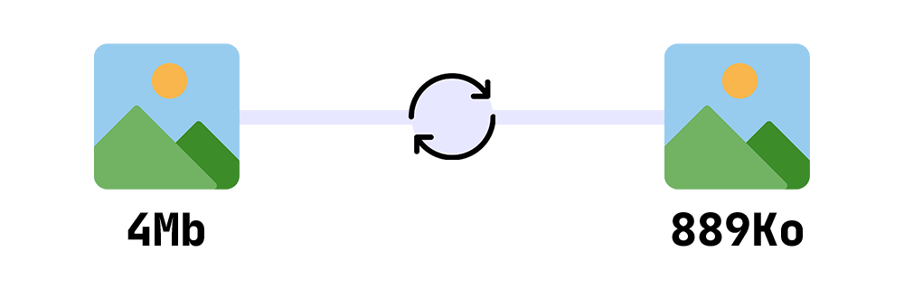

# Image Compressor



Image Compressor is a PHP library to compress images via the API resmush.it.


## Installation

Install the library via Composer:

```bash
composer require jensone/image-compressor
```

## Usage

### Compress a local image

```php
use Jensone\ImageOptimizer\ImageOptimizer;

$optimizer = new ImageOptimizer();
$optimizedImagePath = $optimizer->compressFile('/path/to/image.jpg');
```

### Compress an image from a URL

```php
use Jensone\ImageOptimizer\ImageOptimizer;

$optimizer = new ImageOptimizer();
$optimizedImagePath = $optimizer->compressFromUrl('https://example.com/image.jpg');
```

## Options

You can pass an array of options to the constructor:

```php
use Jensone\ImageOptimizer\ImageOptimizer;

$optimizer = new ImageOptimizer([
    'quality' => 92,
    'timeout' => 30
]);
```

The available options are:

- `quality`: the quality of the compressed image (default: 92)
- `timeout`: the timeout in seconds for the API call (default: 30)

---

## License

Image Optimizer is licensed under the MIT License. See the [LICENSE](LICENSE) file for more information.
